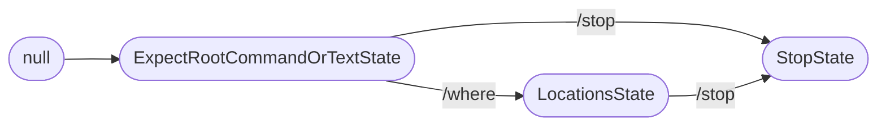

```mermaid
graph LR
    null([null]) --> ExpectRootCommandOrTextState([ExpectRootCommandOrTextState])
    ExpectRootCommandOrTextState([ExpectRootCommandOrTextState]) -- /where --> LocationsState([LocationsState])
    ExpectRootCommandOrTextState([ExpectRootCommandOrTextState]) -- /stop --> StopState([StopState])
    LocationsState -- /stop --> StopState    

```